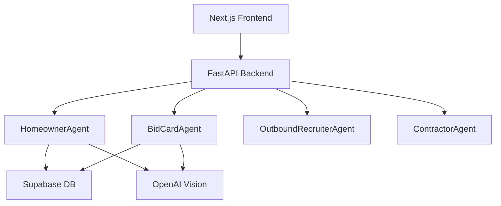

# 🚀 InstaBids - AI-Driven Multi-Agent Bidding Platform

> **IMPORTANT**: This codebase is designed for 100% AI-driven development. Every file, prompt, and structure is optimized for AI agents to read, understand, and build upon using Google ADK 1.0.0+ and Supabase.

## 🎯 Project Mission

InstaBids is a multi-agent system that revolutionizes home improvement project bidding by:
- Using AI agents to assist homeowners in scoping projects
- Automatically generating structured "bid cards" from descriptions and photos
- Intelligently matching and inviting suitable contractors
- Facilitating AI-mediated bidding and communication

## 🏗️ Architecture Overview



## 🤖 For AI Coding Agents

### Quick Start
1. **Read First**: `/docs/README_FOR_AI_CODERS.md`
2. **Common Issues**: `/docs/COMMON_PITFALLS.md`
3. **Find Prompts**: `/.prompts/` directory
4. **ADK Patterns**: `/docs/ADK_BEST_PRACTICES.md`

### Development Workflow
```bash
# Reset environment (ALWAYS run first)
./scripts/reset_env.sh  # or .ps1 for Windows

# Start development
poetry run adk web      # ADK Dev UI
poetry run adk test     # Run ADK tests
pytest                  # Run unit tests
```

### Key Rules
- Export variable MUST be `agent` (not `root_agent`)
- Import: `from google import genai` (NOT `import google.generativeai`)
- Tools need `tool_context: ToolContext` as first parameter
- Use state prefixes: `user:`, `app:`, `temp:`
- Docstrings must be ≥5 lines with Args/Returns sections

## 📁 Project Structure

```
instabids/
├── .adk/
│   └── components.json         # ADK agent registry
├── .prompts/                   # AI instruction library
│   ├── system/                 # Agent role definitions
│   ├── tasks/                  # Reusable task templates
│   ├── conventions/            # Coding standards
│   └── meta/                   # Prompt selection logic
├── docs/                       # AI-consumable documentation
├── src/
│   └── instabids/             
│       ├── agents/            # ADK agent implementations
│       ├── tools/             # Reusable tools
│       ├── api/               # FastAPI backend
│       └── data/              # Supabase repositories
├── frontend/                   # Next.js application
├── db/migrations/             # SQL migration files
├── tests/                     # Comprehensive test suite
└── scripts/                   # Utility scripts
```

## 🛠️ Technology Stack

| Layer | Technology | Version | Purpose |
|-------|------------|---------|---------|
| AI Framework | Google ADK | ~1.0.0 | Agent orchestration |
| Language Model | OpenAI GPT | 4+ | Agent intelligence |
| Backend | FastAPI | ^0.115.0 | API layer |
| Frontend | Next.js | ^14.0.0 | Web interface |
| Database | Supabase/PostgreSQL | Latest | Data persistence |
| Vector Store | pgvector | 0.7.0+ | RAG capabilities |
| Container | Python | 3.12-slim | Runtime environment |

## 🚨 Critical Dependencies

```toml
[tool.poetry.dependencies]
python = "^3.12"
google-adk = {extras = ["vertexai"], version = "~1.0.0"}
google-genai = ">=1.16.1"
protobuf = "==5.29.4"  # MUST pin this version
httpx = ">=0.28.1,<1"
pydantic = "^2.11"
supabase = "^2.10.0"
fastapi = "^0.115.0"
```

## 🔄 Agent Communication Flow

1. **User Input** → Frontend → FastAPI → HomeownerAgent
2. **Project Creation** → HomeownerAgent → BidCardAgent → Database
3. **Contractor Matching** → OutboundRecruiterAgent → Contractors
4. **Bidding** → ContractorAgent → Database → Frontend

## 🧪 Testing Requirements

Every PR must pass:
- `poetry run adk test` - ADK agent tests
- `pytest` - Unit/integration tests
- `pnpm test` - Frontend tests
- `gcloud agent-engines deploy --validate-only` - Deployment validation

## 🚀 Deployment

Production deployment uses:
- Vertex AI Agent Engine for ADK agents
- Supabase Cloud for database/auth
- Vercel/Cloud Run for web services

## 📝 For Human Supervisors

This project follows a 6-sprint roadmap:
1. **Sprint 0**: Bootstrap infrastructure ✅
2. **Sprint 1**: Prompt infrastructure
3. **Sprint 2**: Doctor route & health checks
4. **Sprint 3**: Supabase CRUD tools
5. **Sprint 4**: Live Gateway implementation
6. **Sprint 5**: First business agent (HomeownerAgent)

## 🔗 Resources

- [Google ADK Documentation](https://github.com/google/adk-python)
- [Supabase AI & Vectors Guide](https://supabase.com/docs/guides/ai)
- [Project Architecture](./docs/PROJECT_ARCHITECTURE.md)
- [Contributing Guidelines](./CONTRIBUTING.md)

---

**Remember**: This is a living codebase designed for AI agents. Every decision prioritizes clarity, structure, and automated validation.
