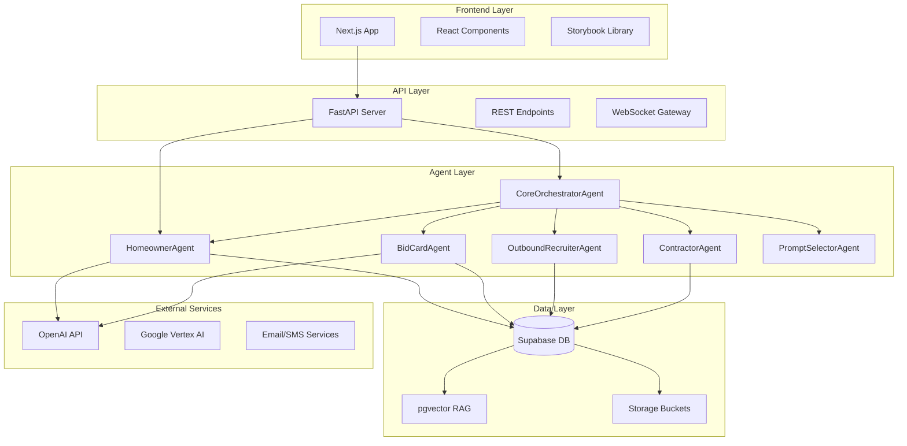
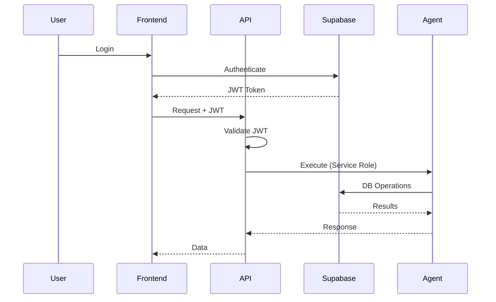
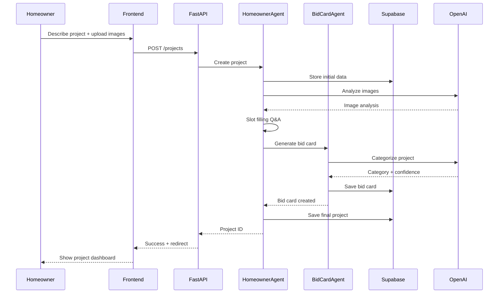
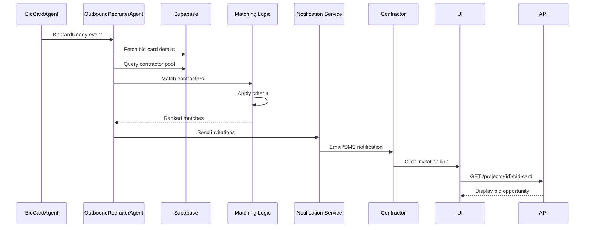
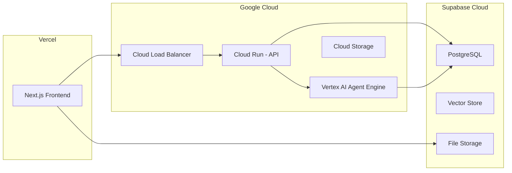

# 🏗️ InstaBids Project Architecture

> **Overview**: Complete technical architecture for the AI-driven multi-agent bidding platform.

## 🎯 System Overview



## 📦 Component Architecture

### 1. Frontend Components

#### Next.js Application
- **Location**: `/frontend`
- **Purpose**: User interface for homeowners and contractors
- **Key Features**:
  - Server-side rendering for SEO
  - Real-time updates via WebSocket
  - Progressive Web App capabilities
  - Responsive design system

#### Component Library
```typescript
// Key UI Components
- ProjectCreationWizard
- BidCardDisplay
- ChatInterface
- ContractorDashboard
- BidSubmissionForm
- NotificationCenter
```

### 2. API Architecture

#### FastAPI Structure
```python
api/
├── main.py              # Application entry
├── routers/
│   ├── projects.py      # Project endpoints
│   ├── agents.py        # Agent interactions
│   ├── bids.py          # Bidding system
│   └── messages.py      # Messaging
├── middleware/
│   ├── auth.py          # Authentication
│   └── logging.py       # Request logging
└── dependencies/
    ├── database.py      # DB connections
    └── agents.py        # Agent factory
```

#### Key Endpoints
| Method | Path | Purpose |
|--------|------|----------|
| POST | `/projects` | Create new project |
| GET | `/projects/{id}` | Get project details |
| POST | `/projects/{id}/messages` | Send message |
| GET | `/projects/{id}/bid-card` | Get bid card |
| POST | `/bids` | Submit contractor bid |
| GET | `/agents/status` | Agent health check |

### 3. Agent Architecture

#### Agent Hierarchy
```
CoreOrchestratorAgent (Master)
├── PromptSelectorAgent (Meta)
├── HomeownerAgent (Primary)
├── BidCardAgent (Processing)
├── OutboundRecruiterAgent (Matching)
└── ContractorAgent (Bidding)
```

#### Agent Communication Patterns

##### Pattern 1: Direct Tool Invocation
```python
# Agent directly calls tool
result = await agent.call_tool(
    "analyze_project_image",
    image_path="roof_damage.jpg"
)
```

##### Pattern 2: Event-Based (A2A)
```python
# Agent emits event
await emit_event(ProjectCreatedEvent(
    project_id=project_id,
    owner_id=user_id
))

# Another agent handles
@on_event(ProjectCreatedEvent)
async def handle_project_created(event):
    # Generate bid card
    pass
```

##### Pattern 3: Workflow Orchestration
```python
# Sequential workflow
workflow = SequentialAgent([
    CreateProjectTask(),
    GenerateBidCardTask(),
    InviteContractorsTask()
])
```

### 4. Data Architecture

#### Database Schema

##### Core Tables
```sql
-- Projects table
CREATE TABLE projects (
    id UUID PRIMARY KEY DEFAULT gen_random_uuid(),
    owner_id UUID REFERENCES auth.users(id),
    title TEXT NOT NULL,
    description TEXT,
    status TEXT DEFAULT 'draft',
    created_at TIMESTAMPTZ DEFAULT NOW(),
    updated_at TIMESTAMPTZ DEFAULT NOW()
);

-- Bid cards table
CREATE TABLE bid_cards (
    id UUID PRIMARY KEY DEFAULT gen_random_uuid(),
    project_id UUID REFERENCES projects(id),
    category TEXT NOT NULL,
    job_type TEXT,
    budget_range JSONB,
    timeline JSONB,
    scope_json JSONB,
    photo_meta JSONB,
    ai_confidence FLOAT,
    status TEXT DEFAULT 'draft',
    created_at TIMESTAMPTZ DEFAULT NOW()
);

-- Messages table
CREATE TABLE messages (
    id UUID PRIMARY KEY DEFAULT gen_random_uuid(),
    project_id UUID REFERENCES projects(id),
    sender_role TEXT NOT NULL,
    content TEXT NOT NULL,
    metadata JSONB,
    created_at TIMESTAMPTZ DEFAULT NOW()
);

-- User preferences table
CREATE TABLE user_preferences (
    id UUID PRIMARY KEY DEFAULT gen_random_uuid(),
    user_id UUID REFERENCES auth.users(id),
    key TEXT NOT NULL,
    value JSONB,
    confidence FLOAT DEFAULT 1.0,
    updated_at TIMESTAMPTZ DEFAULT NOW(),
    UNIQUE(user_id, key)
);
```

#### Vector Store (RAG)
```sql
-- Knowledge base with embeddings
CREATE TABLE project_knowledge (
    id BIGSERIAL PRIMARY KEY,
    content TEXT,
    embedding VECTOR(1536),
    source_type TEXT,
    metadata JSONB,
    created_at TIMESTAMPTZ DEFAULT NOW()
);

-- Similarity search function
CREATE FUNCTION match_project_knowledge(
    query_embedding VECTOR(1536),
    match_threshold FLOAT DEFAULT 0.7,
    match_count INT DEFAULT 5
)
RETURNS TABLE (...) AS $$ ... $$;
```

### 5. Security Architecture

#### Authentication Flow


#### Row Level Security
```sql
-- Homeowners see own projects
CREATE POLICY "own_projects" ON projects
    FOR ALL USING (auth.uid() = owner_id);

-- Messages visible to project participants
CREATE POLICY "project_messages" ON messages
    FOR SELECT USING (
        EXISTS (
            SELECT 1 FROM projects
            WHERE projects.id = messages.project_id
            AND projects.owner_id = auth.uid()
        )
    );
```

## 🔄 Data Flow Diagrams

### Project Creation Flow


### Contractor Matching Flow


## 🚀 Deployment Architecture

### Container Structure
```yaml
services:
  frontend:
    build: ./frontend
    ports: ["3000:3000"]
    environment:
      - NEXT_PUBLIC_API_URL
      - NEXT_PUBLIC_SUPABASE_URL
      
  api:
    build: ./backend
    ports: ["8000:8000"]
    environment:
      - DATABASE_URL
      - OPENAI_API_KEY
      - SUPABASE_SERVICE_KEY
      
  agents:
    build: ./agents
    environment:
      - GOOGLE_API_KEY
      - GOOGLE_CLOUD_PROJECT
      
  postgres:
    image: supabase/postgres
    volumes:
      - ./db/migrations:/docker-entrypoint-initdb.d
```

### Production Infrastructure


## 📏 Scaling Considerations

### Agent Scaling
- Horizontal scaling via Vertex AI Agent Engine
- Agent pool management for concurrent requests
- Caching frequent agent responses

### Database Scaling
- Connection pooling with pgBouncer
- Read replicas for analytics
- Partitioning for large tables (messages, events)

### API Scaling
- Auto-scaling Cloud Run instances
- Redis for session management
- CDN for static assets

## 🔒 Security Measures

1. **API Security**
   - JWT validation on all endpoints
   - Rate limiting per user
   - CORS configuration
   - Input validation with Pydantic

2. **Agent Security**
   - Service role for privileged operations
   - Audit logging for all agent actions
   - Sandboxed code execution

3. **Data Security**
   - Encryption at rest (Supabase)
   - TLS for all connections
   - PII handling compliance
   - Regular security audits

## 📊 Performance Targets

| Metric | Target | Current |
|--------|--------|---------|
| API Response Time | <200ms | TBD |
| Agent Response Time | <3s | TBD |
| Project Creation | <5s | TBD |
| Bid Card Generation | <10s | TBD |
| Contractor Matching | <30s | TBD |
| Concurrent Users | 10,000 | TBD |

## 🔧 Development Guidelines

1. **Code Organization**
   - Domain-driven design
   - Clear separation of concerns
   - Dependency injection patterns

2. **Testing Strategy**
   - Unit tests for business logic
   - Integration tests for workflows
   - E2E tests for critical paths

3. **Documentation**
   - API documentation via OpenAPI
   - Agent behavior documentation
   - Deployment runbooks

---

**Note**: This architecture is designed for scalability and maintainability. All components are loosely coupled to allow independent evolution.
